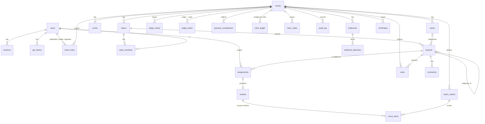

# Data model

SQLAlchemy 2 declarative models in `src/podium/models/`, migrated with Alembic. SQLite (WAL) by
default; every type is portable and `PODIUM_DATABASE_URL` switches to Postgres with the same
migrations. All timestamps are stored as UTC and handed to Python as timezone-aware values
(`UTCDateTime` refuses naive input). Every entity that appears in a URL or an export has a string
`public_id`; imported rows keep the id they arrived with (`prj_07`, `jdg_24`), new rows get a
prefixed random id (`prj_k7x2m9qa`). Integer primary keys stay internal.

## Entity relationships



## Tables and invariants

| Table | Key columns | Invariants (enforced in the database unless noted) |
|---|---|---|
| `users` | email UQ, name, password_hash (argon2id), is_admin, public_id | one identity, many event roles |
| `sessions` | token_hash PK, user_id, label, expires_at, revoked_at | cookie holds the raw token; only SHA-256 stored; `demo:*` sessions are never revoked by logout (service) |
| `api_tokens` | user_id, token_hash UQ, prefix, last_used_at, revoked_at | raw token shown once |
| `events` | slug UQ, public_id, is_public, submissions_open/close_at, judging_opened/closed_at, voting_open/close_at, results_published_at, archived_at, voting_mode, quadratic_enabled, voting_credits, comments_enabled, reviews_per_project, max_team_size, normalization_method, published_ranking | the **stage** (draft → upcoming → open → closed → judging → voting → published → archived) is derived from these, never stored |
| `event_roles` | event_id, user_id, role | **UQ(event, user)** — one role per person per event → a judge can't compete |
| `judge_invites` | event_id, email, token_hash UQ, track_public_ids JSON, expires_at, accepted_at | link-based; hashed |
| `judge_tracks` | event_id, user_id, track_id | UQ(event, user, track) |
| `tracks` | event_id, name, position, public_id | UQ(event, name); delete blocked while projects use it (service) |
| `prizes` | event_id, name, amount_text, track_id NULL, position | |
| `teams` | event_id, name, invite_code UQ, public_id | one project per team (service); one team per person per event (service) |
| `team_members` | team_id, user_id, role lead/member | UQ(team, user); size ≤ `events.max_team_size` (service) |
| `projects` | event_id, team_id, track_id NULL, title, summary, description, repo/demo/video_url, status draft/submitted/withdrawn, submitted_at, withdrawn_at, unlocked_until, duplicate_of_id | drafts visible only to the team and organizers; editable only inside the window or an organizer unlock (service) |
| `rubric_criteria` | event_id, key, name, weight, min_score, max_score, position, archived_at | UQ(event, key); structure locks when judging opens, weights stay editable; scored criteria archive instead of delete (service) |
| `assignments` | event_id, judge_id, project_id, status pending/in_progress/done, method manual/auto/import | **UQ(judge, project)**; never the judge's own team (service) |
| `reviews` | assignment_id UQ, event_id, judge_id, project_id, comment, status draft/submitted, submitted_at | **UQ(judge, project)**; submit requires every criterion (service) |
| `score_items` | review_id, criterion_id, value | UQ(review, criterion); the only stored scoring facts |
| `pairwise_comparisons` | event_id, judge_id, project_a_id, project_b_id, winner_id NULL, skip_reason, source judge/derived | both projects assigned to the judge (service) |
| `votes` | event_id, project_id, voter_key, voter_user_id NULL, credits, ip_hash, ua_hash, flagged, voided_at, void_reason | **UQ(event, project, voter_key)**; window checked in service |
| `voter_ledger` | event_id, voter_key, mode, credits_spent | UQ(event, voter); quadratic budget |
| `voter_codes` | event_id, code_hash UQ, email NULL, used_at, expires_at | single use |
| `comments` | project_id, user_id, body, hidden_at, hidden_by | hidden, never deleted |
| `audit_log` | event_id NULL, actor_id NULL, action, entity_type, entity_id, meta JSON, ip_hash, prev_hash, row_hash | append-only; `row_hash = sha256(prev_hash + canonical row)` |
| `webhooks` | event_id, url, secret, event_types JSON, active | |
| `webhook_deliveries` | webhook_id, event_type, payload JSON, status pending/delivered/failed, attempts, next_attempt_at, last_status_code, last_error | retried 30 s → 5 min → 30 min |
| `certificates` | event_id, kind participation/judge/winner, user_id, team_id, serial UQ, payload JSON, signature, revoked_at | ed25519 over canonical JSON |
| `instance_settings` | key PK, value | signing public key |

Indexes exist on every foreign key and on the hot pairs (`projects(event, status)`,
`assignments(event, judge)`, `reviews(event, judge)`, `votes(event, project)`).

## What is computed, not stored

The event **stage** (draft, upcoming, open, closed, judging, judging closed, voting,
published, archived) is derived on every request from the timestamps on `events`; see
ARCHITECTURE.md → Event lifecycle.

Raw weighted totals, normalized scores, ranks, ties, disagreement, judge calibration statistics,
vote tallies, Bradley-Terry strengths, judging progress, the event stage, and every "attention"
flag. See `JUDGING.md` for the formulas. This is deliberate: an organizer can change a weight or
the normalization method at any time and every figure is re-derived consistently.

## Import and export paths

**In.** `docker compose up` seeds `fixtures/fixtures.json` through `seed/fixtures.import_fixtures`,
the same function behind *Organizer → Data → Import* and `POST /api/v1/events/import`. The base
shape is the DOGFOOD fixtures format (`event`, `tracks`, `judges`, `teams`, `projects`, `scores`);
an optional `podium` block carries what that shape can't: event dates and settings, track
descriptions, prizes, the rubric (weights, scales), project details and status, assignments and
review statuses. Rows are matched by public id and updated in place, so imports are idempotent; a
dry run executes the import inside a savepoint and rolls it back, returning the report.

Duplicate detection runs on import: a second project from the same team with the same repository
(or title) is flagged `duplicate_of` and surfaced on the organizer dashboard — the fixture's
`prj_41` is exactly this.

**Out.** `GET /api/v1/events/{slug}/export.json` returns the same shape (plus the `podium` block);
`export → import → export` is byte-for-byte stable on the base sections (tested). The `podium`
block also carries prize awards (`prizes[].project`), which re-import. Four sections are exported
for the record only and are ignored on import: `votes` (voter keys are hashed, addresses are never
exported), `comments`, `certificates` (signed by the exporting instance's key, so they verify
against that instance's well-known key, not the importer's) and `audit` (append-only by design:
a re-imported log would be a copy, not a continuation). Per-table CSVs: `projects`, `teams`,
`assignments`, `reviews` (raw value per criterion), `scores` (aggregated, raw and normalized,
ranks, a `confidence` column that says `thin` below the review target), `audit`. CSV cells that
start with `=`, `+`, `-` or `@` are prefixed with a quote so spreadsheets never execute them.

**Between databases.** Point `PODIUM_DATABASE_URL` at Postgres and run the same Alembic
migrations; move an event by exporting from one instance and importing into another. The
certificate signing key lives in `PODIUM_DATA_DIR/keys/` and must travel with the data if issued
certificates should keep verifying.

## Migrations

```
uv run alembic revision --autogenerate -m "describe the change"
uv run alembic upgrade head
```

The container runs `alembic upgrade head` on every boot. Batch mode is enabled so SQLite can
alter tables; custom types render as their database type so migration files never import
application code.
