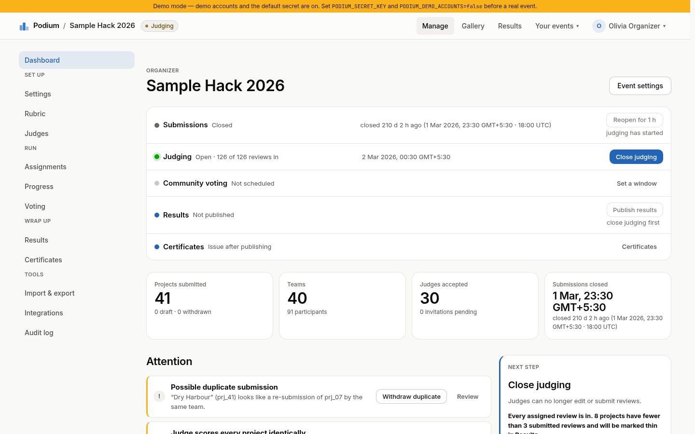
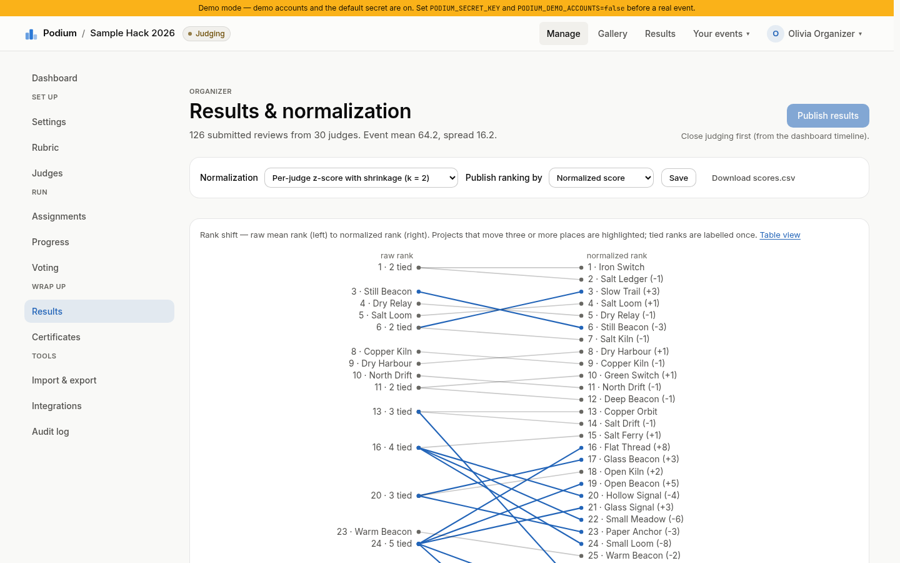
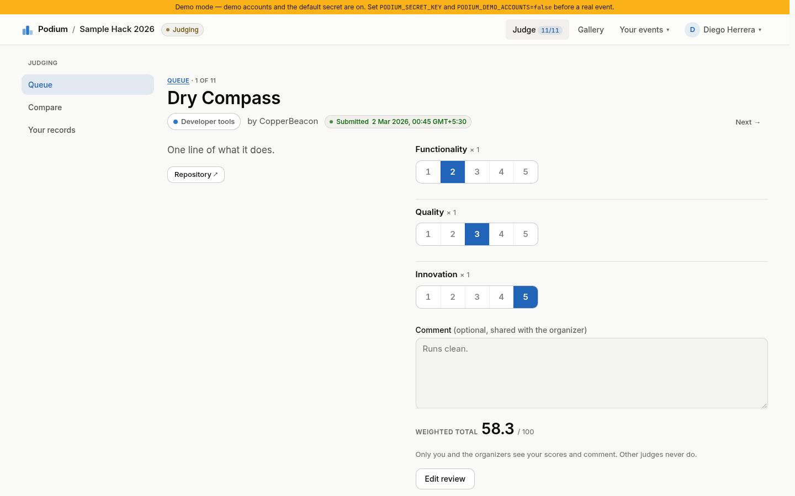

# Podium

[](https://github.com/Nikhils-G/podium/actions/workflows/ci.yml)

**Open-source, self-hostable hackathon submission and judging platform.** One container, one
command, no cloud dependencies. Built for organizers who need weighted rubrics, judging that
can't leak, documented score normalization, community voting that resists stuffing, and a way to
get their data back out.

```
docker compose up
```

That boots a fully seeded portal on <http://localhost:8080> with the DOGFOOD fixture event (41
projects, 30 judges, 8 tracks and 126 reviews) and prints test logins for every role.

## Check every claim

1. **Run it:** `docker compose up`, then open <http://localhost:8080>. Nothing is fetched at run
   time; CI boots the same image with `--network none` on every push to main and every pull
   request.
2. **The official checker:** `python3 tools/run.py .dogfood.toml` prints 7 of 7 checks passing and
   `claimed T1 T2 T3 T4, verified T1 T2`. [`acceptance-report.txt`](acceptance-report.txt) is its
   exact output; [CI](https://github.com/Nikhils-G/podium/actions/workflows/ci.yml) rebuilds the
   image, re-runs the checker and fails if the output differs by a single byte.
3. **T3 and T4 have no official checks.** They are covered by tier-named CI steps and by
   [`tests/test_voting.py`](tests/test_voting.py) and [`tests/test_t4.py`](tests/test_t4.py).
4. **See T3 in 60 seconds on a fresh boot:** sign in as the organizer → **Voting** → set the window
   from now to an hour from now with *Signed-in accounts* → sign in as the participant → open
   `/e/sample-hack-2026/vote` → cast a vote. Counts stay hidden until the window closes *and* the
   results are published.
5. **Watch the demo video:** <https://vimeo.com/1230731798>. It shows the full lifecycle (set-up, submission,
   judging, publishing) using the demo accounts.

## Screenshots

| Organizer dashboard | Results and normalization | Judge scoring |
|---|---|---|
|  |  |  |

## What it does

| Tier | Feature | Evidence |
|---|---|---|
| **T1 Core** | Accounts and sessions; per-event roles (participant, judge, organizer, admin, visitor); events with dates, tracks and prizes; teams by invite link; draft → submit → edit until the deadline; deadline enforced server-side; public gallery with search and filters | ✅ verified by the organizer's checker |
| **T2 Judging** | Judge invitations by link; organizer-weighted rubric; manual and balanced auto-assignment with preview; judge console with autosaving reviews; **role isolation enforced in the backend**; live progress dashboard; per-judge normalization with a documented method; CSV export at every stage | ✅ verified by the organizer's checker |
| **T3 Public** | Community voting (signed-in, single-use codes, or open link), optional quadratic budgets; comments; results and vote counts hidden until the window closes *and* the organizer publishes; per-voter randomized ballots; rate limits, duplicate detection, burst flagging, honeypot, audit trail | ✅ built · `tests/test_voting.py` in CI |
| **T4 Stretch** | REST API covering every console action with OpenAPI docs served offline; webhooks with HMAC-signed, retried deliveries; ed25519-signed certificates and judge records with public verification; embeddable gallery; whole-event JSON import/export | ✅ built · `tests/test_t4.py` in CI |
| **Bonuses** | Normalization proof on the fixture data (Results page + [`JUDGING.md`](JUDGING.md)); Bradley-Terry pairwise judging mode; [`THREAT-MODEL.md`](THREAT-MODEL.md); API-first design with a full OpenAPI spec | ✅ |

## Run it

**With Docker (the judged path).** From a clean clone:

```
docker compose up
```

Wait for `seeded. test logins:` in the log, then open <http://localhost:8080>. The image is built
once (that needs the network); running it needs nothing external. Every font, script and style is
served from the container.

**Without Docker** (Python 3.12 and [uv](https://docs.astral.sh/uv/)):

```
uv sync
make migrate && make seed      # creates ./data/podium.db and prints the logins
make dev                       # http://127.0.0.1:8080
```

## Demo logins

`docker compose up` and `make dev` run with `PODIUM_DEMO_ACCOUNTS=true` and seed these identities (the setting is off by default in the code, so a plain `uvicorn` start never creates them). The **Sign
in** page has one-click buttons for them, and the boot log prints the session cookies below, which
are also what `.dogfood.toml` uses.

| Role | Email | Who |
|---|---|---|
| organizer | `organizer@podium.local` | organizes *Sample Hack 2026* |
| judge_a | `diego.herrera@example.org` (`jdg_24`) | the fixture judge with the most reviews (11) |
| judge_b | `jonas.vogel@example.org` (`jdg_26`) | another fixture judge (10 reviews) |
| participant | `priya1@example.org` | a member of team `tm_01` |
| admin | `admin@podium.local` | instance admin |

Password for every demo and fixture user: **`demo-pass`**. Session tokens are derived from
`PODIUM_SECRET_KEY`, so with the default secret they are identical on every fresh install (change
the secret and disable demo accounts before running a real event; see *Operations*).

## A five-minute tour

1. **Sign in as organizer** → you land on the *run-of-show* dashboard. The **Attention** panel
   already shows what the fixture data planted: a possible duplicate submission (`prj_41` re-submits
   `prj_07` from the same team), a judge who scored every project identically (`jdg_07`), and
   projects below the review target.
2. **Results** → the ranking with raw and normalized scores side by side, the rank shift chart,
   judge calibration (spot the flat scorer), and the Bradley-Terry pairwise ranking with its
   agreement (ρ) to the scored one. `JUDGING.md` explains every number.
3. **Progress** → live per-judge and per-track completion, missing reviews.
4. **Sign in as judge_a** → the queue, then open a project: segmented 1–5 scoring with a live
   weighted total, autosave, keyboard shortcuts; the **Compare** tab for pairwise choices. Try to
   open `/api/v1/events/sample-hack-2026/judges/jdg_26/reviews` as this judge and you get **403**.
5. **Voting** (organizer → Voting) → set the window and choose a mode on the Voting page, then vote as a
   participant from the gallery; counts stay hidden until you publish.
6. **Integrations / Data / Certificates** → add a webhook and watch deliveries, download
   `export.json` and re-import it (dry run), issue judge records and verify one at `/verify`.
7. **API** → `/api/docs`: a three-column reference rendered from the OpenAPI document, with who can
   call each endpoint, its parameters, curl / Python / JavaScript requests and a response example
   (Swagger UI stays available at `/api/docs/console`). Create a token on `/account`, and
   `curl -H "Authorization: Bearer pdm_…" http://localhost:8080/api/v1/events/sample-hack-2026/exports/scores.csv`.

## Acceptance checker

```
python3 tools/run.py .dogfood.toml --fixtures fixtures/fixtures.json
```

`acceptance-report.txt` in this repo is that command's output against the Docker build. Every T1
and T2 check passes. The checker has no automated checks for T3 and T4, so it prints
`claimed but not verified: T3 T4` for any submission that claims them; those tiers are demonstrated
in the UI, the API, the test suite (`tests/test_voting.py`, `tests/test_t4.py`) and the [demo video](https://vimeo.com/1230731798).

The checker's requests are mirrored in `tests/test_acceptance.py`, so a regression on any checked
route fails `make test` before it fails the judges' run.

On every push to main and every pull request, CI runs this command against a fresh
`docker compose up` and fails if the output differs from the committed `acceptance-report.txt` by
a single byte; a second job runs it inside a container with no network and requires 7 of 7. `tools/fixtures.json` is a byte-identical copy kept beside the checker, as the spec
suggests, so `python3 tools/run.py .dogfood.toml` also works without the flag.

## Configuration

All configuration is environment variables with the `PODIUM_` prefix (or a `.env` file).

| Variable | Default | Meaning |
|---|---|---|
| `PODIUM_SECRET_KEY` | dev value | signs sessions, CSRF, voter cookies, demo tokens. **Set your own** |
| `PODIUM_BASE_URL` | `http://localhost:8080` | used in links, invites, certificates |
| `PODIUM_DATA_DIR` | `./data` (`/data` in Docker) | SQLite database and the signing key |
| `PODIUM_DATABASE_URL` | unset | e.g. `postgresql+psycopg://…` to use Postgres instead of SQLite (driver included; smoke-tested against PostgreSQL 17, CI covers SQLite) |
| `PODIUM_OPEN_EVENT_CREATION` | `false` | `true` lets any signed-in account create events; by default only instance admins can (the demo organizer is one) |
| `PODIUM_SEED_FIXTURES` | `true` | load `fixtures/fixtures.json` at boot (idempotent) |
| `PODIUM_DEMO_ACCOUNTS` | `false` | seed the demo identities and their fixed session tokens (`docker-compose.yml` sets it to `true`) |
| `PODIUM_DEMO_PASSWORD` | `demo-pass` | password for seeded users |
| `PODIUM_SESSION_DAYS` | `14` | session lifetime |
| `PODIUM_RATE_LIMIT_ENABLED` | `true` | per-address limits on login, register, vote, voting-code redeem, comment |
| `FORWARDED_ALLOW_IPS` | `127.0.0.1,::1` | uvicorn's own setting: the proxies whose `X-Forwarded-For` is trusted. Behind a reverse proxy, publish the port as `127.0.0.1:8080:8080` and list the proxy's address (or the Docker bridge subnet); use `*` only when the proxy overwrites `X-Forwarded-For`. Otherwise every user shares the Docker gateway's rate-limit bucket |
| `PODIUM_WEBHOOK_WORKER` | `true` | in-process webhook delivery loop |
| `PODIUM_COOKIE_SECURE` | derived from base URL | force the Secure cookie flag |

## Operations

- **Backup**: the data volume holds the SQLite file and the certificate signing key (`keys/`); that
  is the entire state. Either stop first (`docker compose stop web`, copy the volume, start again)
  or take a consistent hot copy with SQLite's backup API:
  ```
  docker compose exec -T web python -c "import sqlite3; sqlite3.connect('/data/podium.db').backup(sqlite3.connect('/data/backup.db'))"
  docker compose cp web:/data/backup.db ./podium-backup.db
  docker compose cp web:/data/keys ./podium-keys
  ```
  Copying `podium.db` while it runs can tear a WAL database; use one of the two.
- **Reset**: `docker compose down -v` deletes the volume; the next `up` seeds a fresh instance.
- **Upgrade**: pull, `docker compose up --build`. Migrations run on boot (`alembic upgrade head`).
- **First admin**: on an instance with no accounts, the first person to register becomes the admin (audited). Seeded installs already have `admin@podium.local`; an install that seeded fixtures without demo accounts has no admin, so set `PODIUM_OPEN_EVENT_CREATION=true` or flip `is_admin` for one user.
- **Production checklist**: set `PODIUM_SECRET_KEY`, `PODIUM_BASE_URL` (https), leave `PODIUM_DEMO_ACCOUNTS` and `PODIUM_OPEN_EVENT_CREATION` unset (both off),
  `PODIUM_SEED_FIXTURES=false`; put a reverse proxy (Caddy, nginx) in front for TLS; keep one
  container per instance (rate limits and the webhook worker are in-process). With Caddy on the
  host, publish the port as `127.0.0.1:8080:8080`, set `FORWARDED_ALLOW_IPS=172.16.0.0/12` (the
  Docker bridge) and use:
  ```
  podium.example.org {
      reverse_proxy 127.0.0.1:8080
  }
  ```
- **Postgres**: set `PODIUM_DATABASE_URL`; the `psycopg` driver is installed, the schema uses only
  portable types and the same migrations apply. Smoke-tested against PostgreSQL 17 on 2026-09-27:
  migrations, seed (twice), the acceptance checker 7/7 and the organizer pages; CI covers SQLite
  only. Export from one instance and import into another to move an event.
- **Email**: Podium never sends email. Judge invitations and voting codes are links and codes the
  organizer distributes; no SMTP configuration is required.
- **Health**: `GET /healthz` → `{"status":"ok"}`; the Docker image has a healthcheck.

## Documentation

- [`ARCHITECTURE.md`](ARCHITECTURE.md): layers, decisions and their reasons, trade-offs.
- [`DATA-MODEL.md`](DATA-MODEL.md): schema, invariants, import/export paths.
- [`JUDGING.md`](JUDGING.md): assignment strategy, scoring math, normalization defended with the fixture numbers, pairwise mode, isolation matrix.
- [`THREAT-MODEL.md`](THREAT-MODEL.md): what is defended, how, and what isn't.
- [`CHANGELOG.md`](CHANGELOG.md), [`SECURITY.md`](SECURITY.md) (private vulnerability reporting),
  [`CONTRIBUTING.md`](CONTRIBUTING.md), [`THIRD-PARTY-NOTICES.md`](THIRD-PARTY-NOTICES.md).
- `/api/docs` on a running instance is the API reference: quick start, who can call what, errors, rate
  limits, webhooks with signature verification, and every endpoint with requests in curl, Python and
  JavaScript plus a response example, all generated from `/api/openapi.json` so the two cannot drift.
  `/api/docs/console` is the interactive console.

## Development

```
make test      # pytest, 239 tests on a temp database seeded from the real fixtures
make lint      # ruff
make check     # run the organizer's checker against a running portal → acceptance-report.txt
make clean-verify   # what a judge does: rebuild without cache, boot, run the checker
```

CI (`.github/workflows/ci.yml`) runs lint, the migration round trip and drift check, and the
tests grouped by tier on every push to main and every pull request.

## Known limits and trade-offs

- Rate limiting and the webhook worker are in-process; run one container per instance (or move
  both to a shared store before scaling out).
- Open-link voting is deliberately weak (one vote per browser cookie); use codes or accounts when
  it matters. Bursts from one address are flagged for review, not blocked.
- No file uploads: projects link to their repositories, demos and videos.
- Accounts that an import creates share `PODIUM_DEMO_PASSWORD` (there is no email to send a reset).
  Import people who already have accounts, or set a strong `PODIUM_DEMO_PASSWORD` and have them
  change it at `/account`.
- English UI. Times are stored in UTC; the UI shows the viewer's local time with its zone, and
  deadlines keep UTC beside it.
- "Email-gated" voting means single-use codes or links the organizer hands out; Podium sends no
  email.
- Certificates are print-ready HTML, JSON and a QR code with an offline-verifiable signature, not
  PDF.
- The fixture has no assignment records, so each fixture score becomes one completed assignment:
  the dashboard reads "126 of 126 reviews in", and the brief's unfinished batches show up as
  "8 projects have fewer than 3 submitted reviews", marked thin in Results.
- The fixture's duplicate (`prj_41` re-submits `prj_07`) is ranked twice until an organizer
  withdraws one; the dashboard flags it and offers the action until results are published.
- The Bradley-Terry ranking on the demo event is computed from comparisons *derived* from the
  fixture scores (clearly labelled) so the feature has data to show; real events use judges' own
  comparisons.

## License

MIT, see [`LICENSE`](LICENSE). The vendored fonts, htmx and Swagger UI keep their own licenses;
[`THIRD-PARTY-NOTICES.md`](THIRD-PARTY-NOTICES.md) lists each one.
